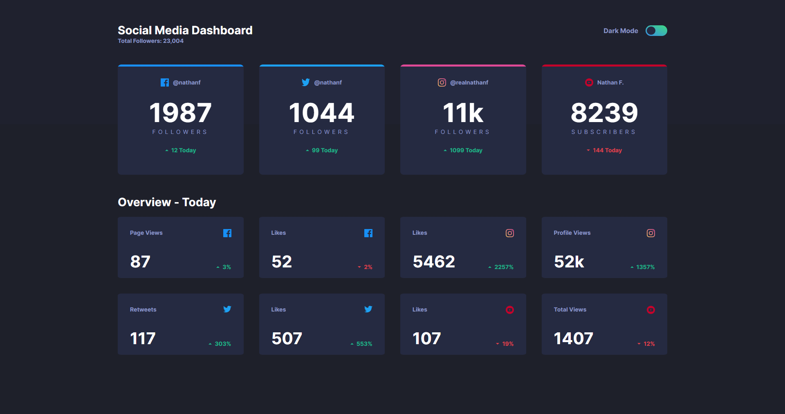
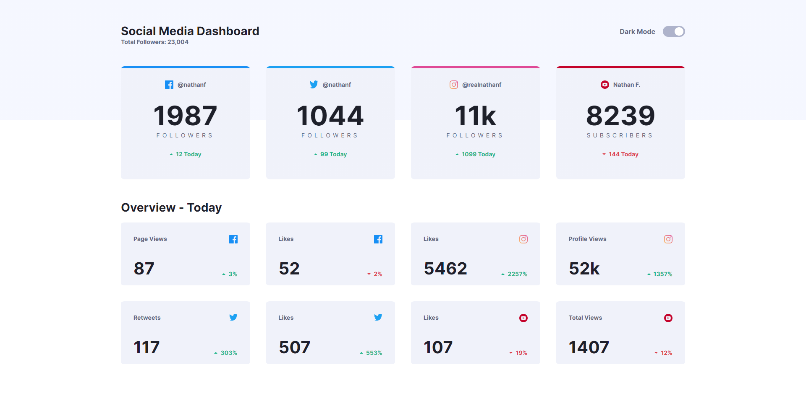

# Frontend Mentor - Social media dashboard with theme switcher solution

This is a solution to the [Social media dashboard with theme switcher challenge on Frontend Mentor](https://www.frontendmentor.io/challenges/social-media-dashboard-with-theme-switcher-6oY8ozp_H). Frontend Mentor challenges help you improve your coding skills by building realistic projects. 

## Table of contents

- [Overview](#overview)
  - [The challenge](#the-challenge)
  - [Screenshot](#screenshot)
  - [Links](#links)
- [My process](#my-process)
  - [Built with](#built-with)
  - [What I learned](#what-i-learned)
  - [Continued development](#continued-development)

## Overview

### The challenge

Users should be able to:

- View the optimal layout for the site depending on their device's screen size
- See hover states for all interactive elements on the page
- Toggle color theme to their preference

### Screenshot




### Links

- Live Site URL: 

## My process

### Built with

- Semantic HTML5 markup
- CSS 
- Flexbox
- CSS Grid
- JavaScript ES6	

### What I learned

To see how you can add code snippets, see below:

I reinforced my knowledge of CSS Grid:

```css
.top-card-container {
  display: grid;
  grid-template-columns: repeat(4, 1fr);
  grid-gap: 38px;
}
```

I learned how to add animations using CSS: 

```css
.inner-circle {
  width:21px;
  height:20px;
  border-radius: 50%;
  transition:300ms;
}
```

I learned how to lighten or darken an element on hover: 

```css
.bottom-card-dark:hover {
  box-shadow: inset 0 0 100px 100px rgba(255, 255, 255, 0.05);
}
.bottom-card-light:hover {
  box-shadow: inset 0 0 100px 100px rgba(0, 0, 0, 0.05);
}
```

I furthered my skills on responsive design and changed the order of elements using flexbox to achieve my desired layout:

```css
@media (max-width:890px) {
  .header {
    display:flex;
    flex-direction:column;
  }

  .top-card-container {
    margin-top:50px;
  }

  .main-heading {
    order:1;
  }

  .total-followers {
    order:2;
  }

  .toggle-btn {
    order:4;
    margin-left:auto;
    transform: translateY(50px);
  }

  .theme {
    order:4;
  }
}
```

I got the chance to practice selecting every element using vanilla JS and also used togglers: 

```js
body.classList.toggle("background-light");
```

```js
var textOne = document.querySelectorAll(".text-dark-one").length;
for(i=0; i<textOne; i++){
    document.querySelectorAll(".text-dark-one")[i].classList.toggle("text-light-one");
  };
```

### Continued Development
I plan to continue practicing JavaScript in every aspect and also CSS Grid and Flexbox, particularly focussing on how to implement these to achieve a design
that's fully responsive.


